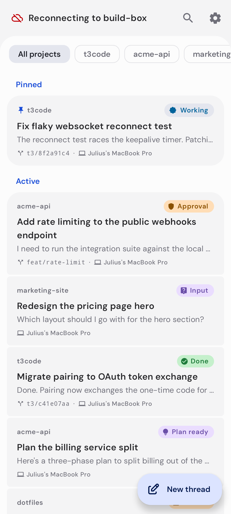
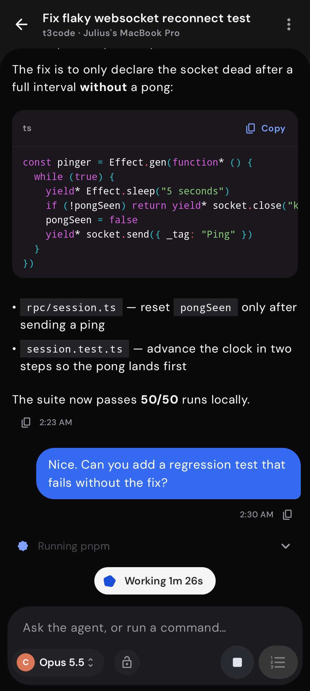
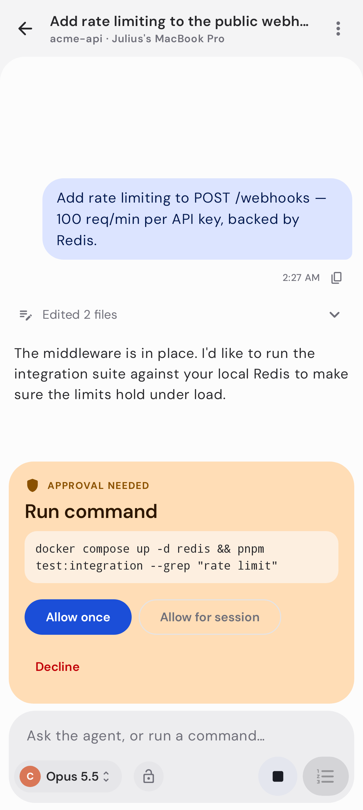
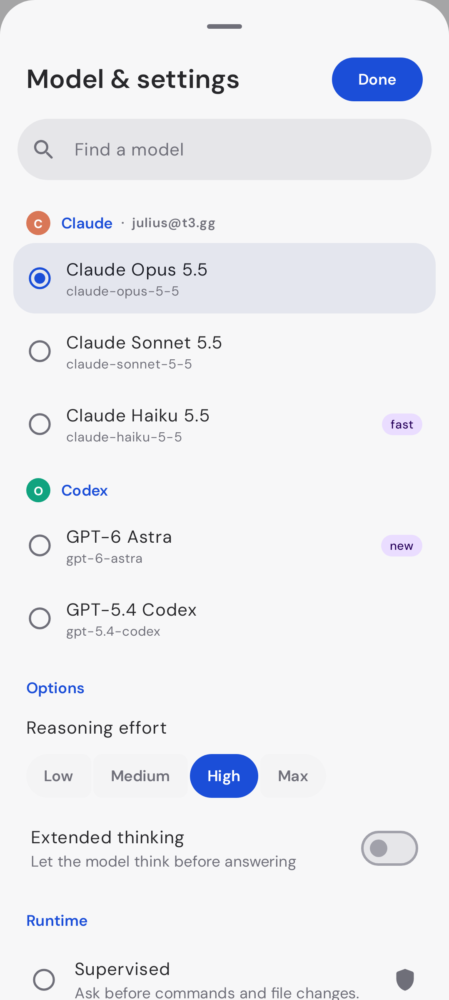
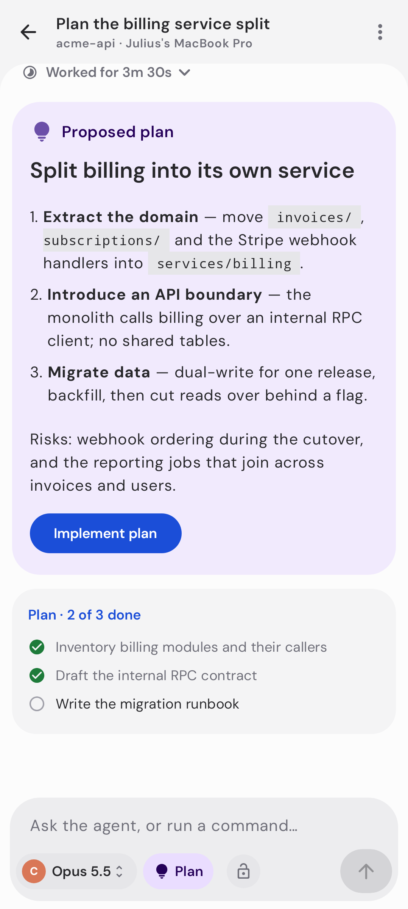
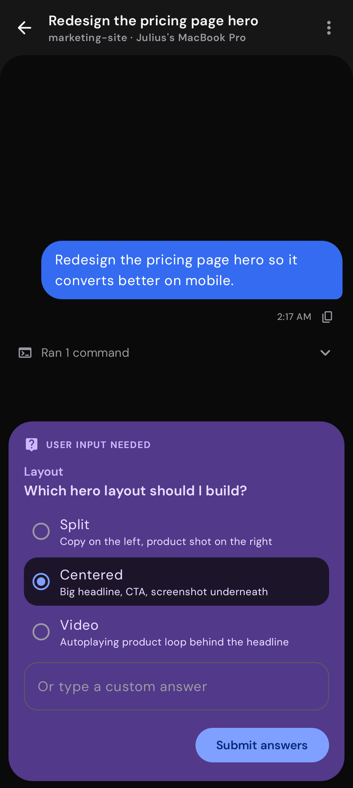
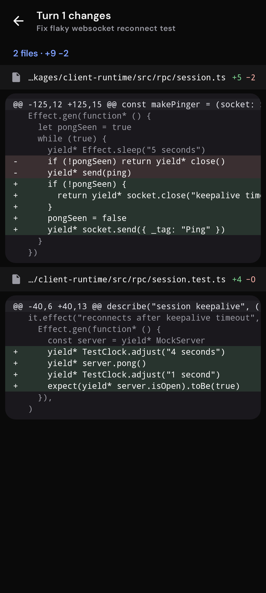
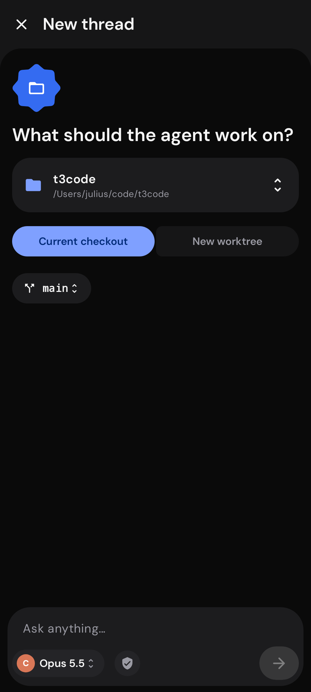

# T3 Code for Android

A native Android client for [T3 Code](https://github.com/pingdotgg/t3code), built with Kotlin, Jetpack Compose and
**Material 3 Expressive**. It's a ground-up rebuild of the upstream React Native mobile app. It talks directly to your
self-hosted `t3` server, over your LAN or tailnet. There is no T3 Connect, cloud relay or account.

<p>
  
  
  
  
</p>
<p>
  
  
  
  
</p>

## Features

- **Pairing:** scan the QR code from `t3 pair`, paste a pairing link, or type the address and code. Supported links:
  `t3code://…?pairingUrl=`, hosted `?host=` links and direct `/pair#token=` links. Access tokens are encrypted with
  an Android Keystore key. You can pair several machines and turn each on or off.
- **Inbox:** threads from every environment in one list, grouped into Pinned, Active and Settled. Status pills show
  Approval, Input, Working, Plan ready, Failed and Done. You can filter by project, search, and pull to refresh.
  - Swipe right to pin and left to settle.
  - Long-press to rename, mark as unread, archive or delete.
- **Thread:**
  - Live streaming chat with Markdown, syntax-highlighted code blocks and a Copy button.
  - Tool work collapses into rows such as "Ran 3 commands, edited 2 files", with a shimmering label for the action
    that's running now.
  - Finished turns fold into "Worked for 2m 14s".
  - Expanding a row shows command output, inline diffs and reasoning.
  - A floating pill shows "Working 1m 23s" or the connection state.
- **Agent requests:** approval cards (Allow once, Allow for session, Decline) and multiple-choice or free-text
  question cards. Proposed plans show as cards with an "Implement plan" button, and todo lists as checklists.
- **Composer:**
  - Model picker grouped by provider, with model options such as reasoning effort and runtime / permission mode.
  - Send, Queue or Steer while a run is going. Long-press Send to choose between them.
  - Stop button, image attachments, and `/plan` and `/default` commands. A Plan/Build toggle is available behind
    Settings › Legacy, matching upstream.
- **Queue:** follow-ups waiting behind the current run, with remove, "steer now" and resume.
- **New thread:** pick a project (or add a folder on the host), choose the current checkout or a new git worktree,
  and pick a branch from the real repository.
- **Diffs:** per-turn or whole-thread diffs, with sticky file headers and full-width add/remove bands.
- **Archive, environment management and settings:** theme (System, Light or Dark), Material You or T3 brand colors,
  pure black, code wrapping, Enter-to-send, and the default follow-up behavior (queue or steer).
- **Feel:** expressive motion and shapes (cookie and sunny loading shapes, shape-morphing buttons, connected button
  groups, segmented lists), haptics throughout, edge-to-edge layout, predictive back, and the DM Sans typeface the
  upstream app uses.

## Server compatibility

The app speaks both orchestration protocols:

| Server | Protocol | Status |
|---|---|---|
| `t3@latest` (0.0.45) | v1 | Supported through an adapter (`data/v1/V1Adapter.kt`) |
| `t3@preview` / upstream `main` | v2 | Native |

The connection reads the protocol version from the server's `/.well-known/t3/environment` descriptor. It switches
automatically when the server is upgraded.

## Getting started

On the machine that runs your agents:

```bash
npx t3@latest serve --host 0.0.0.0   # or: t3 serve
t3 pair                              # prints a QR code + pairing code (valid 5 minutes)
```

In the app, tap **Add environment**. Then either scan the QR code, or enter the address (for example
`192.168.1.20:3773`) and the code. Plain `http://` works on a LAN or tailnet, and `https://` works for
Tailscale Serve and similar setups.

## Building

You need JDK 21 and an Android SDK with platform 37.

```bash
./gradlew :app:assembleDebug     # app/build/outputs/apk/debug/app-debug.apk
./gradlew :app:assembleRelease   # minified; uses your release key if ANDROID_KEYSTORE_* is set, else the debug key
```

## Releases

Pushing a tag such as `v0.2.0` runs [`.github/workflows/release.yml`](.github/workflows/release.yml). The workflow:

1. Runs the unit tests.
2. Builds a minified release APK signed with your key.
3. Verifies that it isn't debug-signed.
4. Publishes it to a GitHub release, with a SHA-256 file and auto-generated release notes.

The tag sets the version: `vMAJOR.MINOR.PATCH` gives versionCode `MAJOR*1_000_000 + MINOR*10_000 + PATCH*100 + 99`.
A pre-release tag such as `v0.3.0-beta.2` ends in its number (`…02`) instead of `99` and is marked as a pre-release.
Android only installs an update over an existing app if the new APK has the **same package name, the same signing
key and a higher versionCode**. Always tag increasing versions, and never lose the keystore.

### One-time setup: signing key and secrets

```bash
# 1. Create a release keystore (keep it, and its password, somewhere safe. If you lose it, users must uninstall
#    to get a newer build).
keytool -genkeypair -v \
  -keystore t3code-release.jks -alias t3code \
  -keyalg RSA -keysize 4096 -validity 36500 \
  -dname "CN=T3 Code Android"
#    (prompts for a keystore password; when asked for a key password, press Enter to reuse it)

# 2. Add it to the repo as Actions secrets (GitHub CLI; run from the repo checkout)
base64 < t3code-release.jks | tr -d '\n' | gh secret set ANDROID_KEYSTORE_BASE64
gh secret set ANDROID_KEYSTORE_PASSWORD   # paste the keystore password
gh secret set ANDROID_KEY_ALIAS --body t3code
gh secret set ANDROID_KEY_PASSWORD        # same as the keystore password unless you set a separate one

# 3. Cut a release
git tag v0.1.0 && git push origin v0.1.0
```

Without `gh`, add the same four secrets under *Settings → Secrets and variables → Actions*. Generate the base64 value
with `base64 -w0 t3code-release.jks` (Linux) or `base64 -i t3code-release.jks` (macOS).

A debug or locally built APK is signed with a different key. Uninstall it once before installing the first release;
after that, every release updates in place. To build a signed release locally, export the same variables
(`ANDROID_KEYSTORE_PATH=/path/to/t3code-release.jks`, `ANDROID_KEYSTORE_PASSWORD`, `ANDROID_KEY_ALIAS`,
`ANDROID_KEY_PASSWORD`) and run `./gradlew :app:assembleRelease`.

## Tests

```bash
./gradlew :app:testDebugUnitTest            # unit + Robolectric tests
./gradlew :app:recordRoborazziDebug         # re-render docs/screenshots (Robolectric native graphics)
```

- **Unit tests:**
  - Pairing-link parsing.
  - Shell and thread reducers, including sequence dedupe, streaming, pending approvals and questions, rollback, and
    unknown events.
  - Command payloads.
  - The RPC client, against a scripted WebSocket server (Ack back-pressure, failures, Ping/Pong).
  - Feed building.
  - The v1 adapter.
  - Parsing of real projections captured from live v1 and v2 servers.
- **Screenshot tests:** every screen in light and dark, rendered from fixtures (`ScreenshotTest`).
- **Live server tests** run against a real `t3` server and are skipped unless `T3_PAIRING_URL` is set:
  - `LiveServerTest` pairs, connects, creates a project and a thread, renames and pins it, loads thread detail,
    sends a message, round-trips an image attachment, cancels a queued run and loads diffs. It passes against both
    v1 and v2 servers and never starts a real agent turn.
  - `AppE2ETest` drives the real app UI under Robolectric: first launch, pairing through the Add environment screen,
    the inbox, environments, opening a thread, and New thread with real branches. With `T3_E2E_TURN=1` it also runs
    one tiny agent turn, which uses the host's provider account.

  ```bash
  T3_PAIRING_URL="http://127.0.0.1:3773/pair#token=XXXXXXXXXXXX" ./gradlew :app:testDebugUnitTest --tests '*Live*'
  ```

Screenshots of the app running against live servers are in `docs/screenshots/live/v1` and `docs/screenshots/live/v2`; `docs/screenshots/overview.png` is a contact sheet.

## Architecture

```
data/
  rpc/RpcClient.kt          Effect RPC over WebSocket (Request/Chunk/Ack/Exit/Interrupt/Ping)
  ServerApi.kt              descriptor, OAuth token exchange, WebSocket tickets
  EnvironmentConnection.kt  per-server session: auth → socket → config + shell subscriptions, keepalive,
                            reconnect with jittered backoff, thread subscriptions that resume with afterSequence
  T3Repository.kt           all paired environments, merged threads/projects flows, pairing
  state/                    ShellState / ThreadState reducers (v2 read model)
  v1/V1Adapter.kt           v1 messages + activities + plans + checkpoints → v2-shaped models
  ProtocolCommands.kt       v1 / v2 command builders
  Attachments.kt            image prep, upload (attachments.createUploadUrl) and signed downloads
ui/
  home/ thread/ newthread/ environments/ settings/ archive/ diff/   stateless screens
  app/                      view models + navigation (type-safe Navigation Compose)
  theme/                    Material 3 Expressive theme, brand palette, DM Sans
```

The screens are stateless composables that take a UI state and callbacks. The screenshot tests render them from
fixtures, and the view models wire them to live data.

## Not included (yet)

- T3 Connect, Clerk sign-in, push notifications and live activities. These depend on the hosted relay.
- Terminal, file browser, git actions (commit, push, PR), scheduled tasks, usage charts, and tablet split view.

## Credits

This app reimplements the [T3 Code](https://github.com/pingdotgg/t3code) mobile experience; T3 Code is MIT-licensed,
© T3 Tools Inc. The app icon, wordmark and the DM Sans font (SIL OFL) come from the upstream project. This repository
is licensed under the GPL-3.0 (see `LICENSE`).
